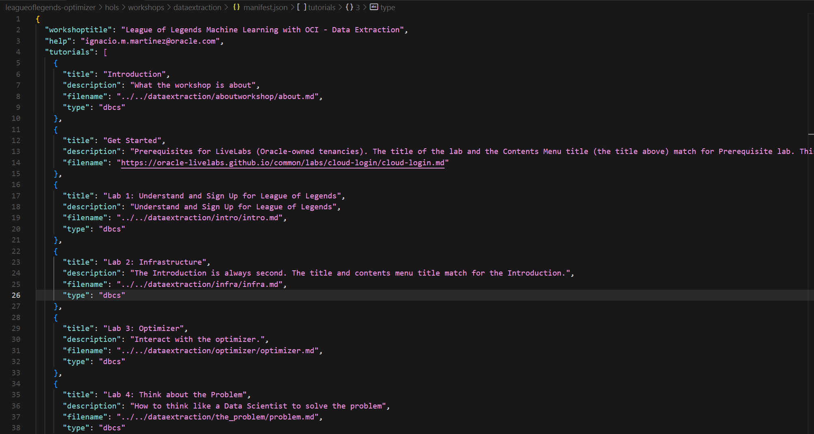

# How to Contribute to a LiveLabs repository (Efficiently)

I will try to explain my workflows, having worked with the LiveLabs format for a few years, because general guidelines are OK but a bit confusing at times (as they require the code to be in their repository, but you might have already developed your workshop using your own GitHub account).

If you plan to use LiveLabs for your project and want to upload your code to their official repositories (required for your lab to be included in Oracle Workshop Management System (WMS)), follow these steps:

1. Start by setting up a repository in the oracle-devrel organization. This repository will be used for development, testing, and building of your project.

2. Inside this repository, create a "manifest.json" file that references the local markdown files. This will allow LiveLabs workshop participants to access the markdown files present in the repository when accessing the workshop through the oracle-devrel link.
    

3. Next, you'll need to create a pull request in the "analytics-ai" repository owned by the LiveLabs team. However, there are a couple of caveats to keep in mind. The filenames in this pull request should reference the development environment with full URLs, rather than local files.
    

4. When creating the pull request, make sure to upload only the content inside your workshop folder, not the markdown files themselves, as it would be redundant.
    

5. Determine the appropriate repository for your project based on its focus. If it's related to AI, which is usually the case, use the ["analytics-ai" repository.](https://github.com/oracle-livelabs/analytics-ai) For other topics, like database or OCI, use the relevant repository.
    

6. Since you might not be a part of the oracle-livelabs organization, you'll need to create a fork of the "analytics-ai" repository in your own GitHub account. You can do this by visiting your own fork of the target repository. In my case, [this would be my fork.](https://github.com/jasperan/analytics-ai)

7. Make the necessary changes to your forked repository. Once you've implemented the changes, open a pull request to contribute your updates back to the LiveLabs team's "analytics-ai" repository.

Happy coding!
